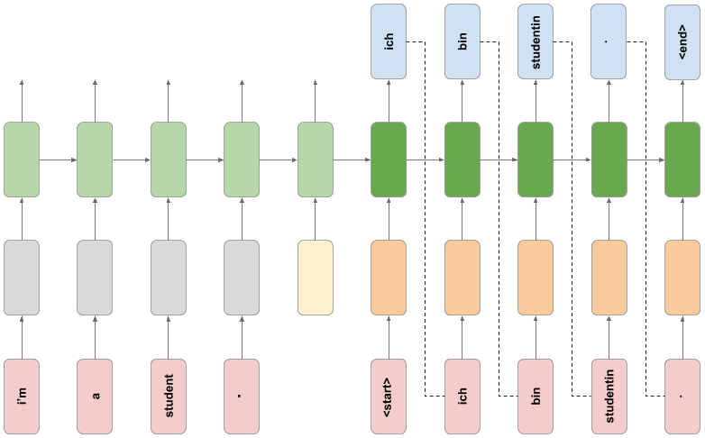

# LinguaNet: Neural Machine Translation from English to German

</img>

## Install TensorFlow
Please refer to [Install TensorFlow 2](https://www.tensorflow.org/install) page for detailed instructions.


## The custom translation model
The following is a schematic of the custom translation model architecture implementing in this project.

</img>

Key:
</img>

The custom model consists of an encoder RNN and a decoder RNN. The encoder takes words of an English sentence as input, and uses a pre-trained word embedding to embed the words into a 128-dimensional space. To indicate the end of the input sentence, a special end token (in the same 128-dimensional space) is passed in as an input. This token is a TensorFlow Variable that is learned in the training phase (unlike the pre-trained word embedding, which is frozen).

The decoder RNN takes the internal state of the encoder network as its initial state. A start token is passed in as the first input, which is embedded using a learned German word embedding. The decoder RNN then makes a prediction for the next German word, which during inference is then passed in as the following input, and this process is repeated until the special `<end>` token is emitted from the decoder.


## Custom layer
The custom layer has the function to add the learned end token embedding to the encoder model:

</img>


## The decoder network
The decoder network follows the schematic diagram below. 

</img>

## Training

We recommend starting with our faster version (CCT-2/3x2) which can be run with the
following command. If you are running on a CPU we recommend this model.
```bash
python main.py \
       --data_number 20000 \
       --epochs 10 \
       --lr 0.001 \
       --batch_size 16 
```

## References

This project was realized during one of my capstone project offered by the Imperial College of London (Via Coursera online courses):
[Deep Learning Specialization with TensorFlow 2](https://www.coursera.org/specializations/tensorflow2-deeplearning?) 
